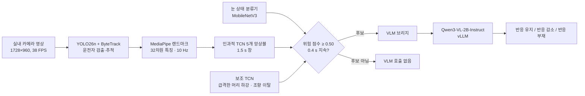

# TCN–VLM 연계형 운전자 무반응 상태 모니터링

[English](README.md) | 한국어

차량 실내 영상에서 **TCN으로 위험 후보 구간만 먼저 고르고, 그 구간만 VLM(Qwen3-VL)으로 확인**하는 단계적 운전자 모니터링 시스템입니다.
매 구간을 VLM으로 분석하는 방식보다 오경보를 줄이면서 반응 부재(no visible response) 탐지 F1을 높이는 것이 목표입니다.

> 전상현, 이예온, 최민석, 김종찬, **「TCN-VLM 연계형 운전자 무반응 상태 모니터링 프레임워크」**, 한국자동차공학회(KSAE) 학술대회 (25AKSAEJ0742) · 국민대학교
> SEA:ME @ Korea 3기 VLM/LLM 프로젝트

<p align="center"></p>

## 핵심 결과

약 287 s 실내 운전자 영상을 1.5 s 구간 192개로 나누고, **반응 부재(NVR) 대 그 외 상태**로 세 시스템을 같은 조건에서 비교했습니다.

| 시스템 | NVR 정밀도 | NVR 재현율 | **NVR F1** | 사건 F1 | 오경보 사건 | 평균 모델 호출 지연 |
| --- | ---: | ---: | ---: | ---: | ---: | ---: |
| TCN 단독 | 0.636 | 0.538 | 0.583 | 0.500 | 4 | 4.9 ms |
| VLM 단독 | 0.625 | **0.769** | 0.690 | 0.400 | 6 | 1,212.5 ms |
| **TCN–VLM–YOLO (제안)** | **0.900** | 0.692 | **0.783** | **0.667** | **2** | 1,344.1 ms |

- 실제 반응 부재 사건 2건을 세 시스템 모두 탐지(사건 재현율 1.000). 제안 구조는 오경보 사건을 VLM 단독 6건에서 2건으로 줄였습니다.
- 위 표는 저장소에 포함된 논문 실행 기록에서 `./scripts/evaluate.sh`로 그대로 재계산됩니다(GPU·영상·가중치 불필요).
- 지연시간은 모델 호출 기준입니다. VLM은 TCN과 비동기로 실행되며, 추론 중에는 중복 호출을 억제합니다.

## 시스템 구조



1. **운전자 추적** — YOLO26n + ByteTrack으로 운전석 인물만 추적하고, 검출이 끊기면 직전 박스와 좌석 영역을 유지합니다.
2. **시계열 특징** — 눈 종횡비·눈 감김 지속시간·PERCLOS, 머리 자세와 각속도, 머리–어깨 상대 변위, 상체 움직임, 관측 신뢰도 등 32차원 특징을 10 Hz로 추출합니다.
3. **TCN 후보 선별** — 5개 인과적 TCN 앙상블이 최근 1.5 s(15 시점)를 보고 위험 점수를 냅니다. 0.50 이상이 0.4 s 지속되면 후보로 선별하며, 급격한 머리 하강·지속적 눈 감김·눈 관측 불확실성을 보조 조건으로 씁니다.
4. **VLM 문맥 확인** — 후보 시점의 1.5 s 운전자 중심 영상과 TCN 점수 추이를 Qwen3-VL에 함께 넣어 눈·머리·상체 상태, 조향 장치 조작, 자발적 움직임, 자세 회복을 판단하고 3상태로 분류합니다. 동승자가 밀거나 받쳐서 생긴 수동적 움직임은 자발적 움직임으로 보지 않도록 판정 기준을 구성했습니다.

세부 파라미터·특징 목록·출력 형식은 [docs/pipeline_details.md](docs/pipeline_details.md)에 정리했습니다.

## 저장소 구조

```text
VLM-LLM/
├── scripts/                  # 실행 진입점 (아래 "실행 방법" 순서대로 사용)
│   ├── evaluate.sh           #   세 시스템 공통 구간 비교 → 논문 표 재현
│   ├── start_vllm.sh         #   Qwen3-VL-2B-Instruct vLLM 서버 (127.0.0.1:8001)
│   ├── start_bridge.sh       #   VLM 브리지 (127.0.0.1:8000), fusion | vlm-only
│   ├── run_tcn_vlm_yolo.sh   #   제안 구조
│   ├── run_vlm_only.sh       #   비교군: 모든 1.5 s 구간을 VLM으로 분류
│   ├── run_tcn_only.sh       #   비교군: TCN 3상태 직접 분류
│   ├── download_assets.sh    #   공개 가중치(YOLO26n, MediaPipe) 다운로드 + SHA256 검증
│   └── check_assets.sh       #   필요한 가중치·영상 존재 여부 점검
├── src/
│   ├── pipeline/             # 세 시스템 실행기 (영상 → 특징 → TCN/VLM → 결과 기록)
│   ├── bridge/               # VLM 프롬프트 구성, vLLM 호출, 3상태 응답 파싱
│   ├── features/             # 운전자 선택(YOLO), 32차원 특징 추출, 급격한 하강 판정
│   ├── models/               # TCN·눈 상태 모델 정의 및 학습 코드
│   └── evaluation/           # 공통 1.5 s 구간 평가, 사건 단위 평가, 그림 생성
├── configs/
│   ├── tcn/                  # 입력 창 설정 (1.5 s / 10 Hz / 32차원)
│   └── ensembles/            # 앙상블 구성·임계값·검증 지표 (가중치 경로는 assets/ 기준)
├── data/labels/              # 평가 영상 정답 라벨 (1 s 단위)
├── results/paper_20260917/   # 논문에 사용한 실행 기록(inputs/)과 평가 결과(evaluation/)
└── assets/                   # (Git 제외) 가중치와 영상을 두는 위치
```

## 실행 방법

### 0. 설치

Python 3.11, CUDA GPU 환경에서 검증했습니다(NVIDIA DGX Spark GB10, Ubuntu). vLLM은 Docker 이미지 `nvcr.io/nvidia/vllm:26.07-py3`를 사용합니다.

```bash
git clone https://github.com/sangj-03/VLM-LLM.git
cd VLM-LLM
python3 -m venv .venv && source .venv/bin/activate   # conda 환경도 가능
pip install -r requirements.txt                      # torch는 플랫폼에 맞는 CUDA 빌드를 먼저 설치
```

모든 스크립트는 `python3`를 사용합니다. 다른 인터프리터를 쓰려면 `PYTHON=/path/to/python ./scripts/...`처럼 지정합니다.

### 1. 논문 결과 재현 (GPU·영상 불필요)

```bash
./scripts/evaluate.sh
```

`results/paper_20260917/inputs/`의 세 실행 기록을 읽어 위 표를 출력하고, 그림과 지표를 `results/paper_20260917/evaluation/`에 다시 씁니다.

```text
system            acc      P      R     F1  event F1  event FP  model ms
TCN-only        0.948  0.636  0.538  0.583     0.500         4       4.9
VLM-only        0.953  0.625  0.769  0.690     0.400         6    1212.5
TCN–VLM–YOLO    0.974  0.900  0.692  0.783     0.667         2    1344.1
```

### 2. 준비물 배치

```bash
./scripts/download_assets.sh   # yolo26n.pt, face_landmarker.task 다운로드
./scripts/check_assets.sh      # 빠진 파일 목록 출력
```

학습한 가중치와 평가 영상은 저장소에 포함하지 않습니다. 아래 위치에 두면 스크립트와 `configs/ensembles/*.json`이 그대로 찾습니다.

```text
assets/
├── videos/1000013115_0-287s.mp4            # 평가 영상 (VIDEO=... 로 다른 영상 지정 가능)
└── weights/
    ├── yolo26n.pt                          # 공개 가중치 (download_assets.sh)
    ├── face_landmarker.task                # 공개 가중치 (download_assets.sh)
    ├── eye_state_mrl_v2_pretrained.pt      # 눈 개폐 분류기 (MRL Eye Dataset 학습)
    └── tcn/
        ├── observable_state_v38/           # 주 TCN, seed 72–76        ─┐
        ├── control_engagement_1p5s/        # 조향 관여 TCN, seed 82–86  ├ 제안 구조
        ├── fall_onset_1s_v32/              # 급격한 하강 TCN, seed 42–46 ─┘
        └── multitask_state_v35/            # TCN 단독 비교군, seed 42–46
```

### 3. VLM 서버와 브리지 실행

터미널을 나눠 순서대로 실행합니다. 처음 실행하면 컨테이너 이미지와 모델 가중치(약 4 GB)를 내려받습니다.

```bash
# 터미널 1: Qwen3-VL-2B-Instruct (OpenAI 호환 API, 127.0.0.1:8001)
./scripts/start_vllm.sh

# 터미널 2: 브리지 (127.0.0.1:8000)
./scripts/start_bridge.sh fusion       # 제안 구조용: 프롬프트에 TCN 점수 추이 포함
# ./scripts/start_bridge.sh vlm-only   # VLM 단독 비교군용
```

`start_vllm.sh`의 GPU 메모리 비율 기본값(0.1)은 128 GB 통합 메모리 기준입니다. 일반 GPU에서는 `GPU_MEMORY_UTILIZATION=0.5`처럼 약 8 GB가 확보되도록 올려 주세요. Docker 없이 설치된 vLLM을 쓰려면 `VLLM_MODE=native`를 붙입니다.

### 4. 세 시스템 실행

영상은 실제 속도로 재생되므로 287 s 영상 기준 한 번에 약 5분 걸립니다. 화면이 있으면 오버레이 미리보기 창이 뜨고, 없으면 자동으로 끕니다.

```bash
./scripts/run_tcn_vlm_yolo.sh   # 제안 구조 (브리지 fusion 모드 필요)
./scripts/run_vlm_only.sh       # VLM 단독 (브리지 vlm-only 모드 필요)
./scripts/run_tcn_only.sh       # TCN 단독 (VLM 불필요)
```

결과는 `outputs/<시스템>/`에 저장됩니다. 추가 인자는 그대로 실행기에 전달되며(`--help`로 전체 옵션 확인), `VIDEO`, `OUTPUT_ROOT`, `BRIDGE_URL` 환경변수로 입력·출력 위치를 바꿀 수 있습니다.

### 5. 새 실행 결과 평가

```bash
./scripts/evaluate.sh --latest    # outputs/ 의 최신 실행 3개 → outputs/evaluation/
```

VLM 호출 시점은 실시간 처리 속도에 따라 달라지므로 재실행하면 수치가 조금씩 달라질 수 있습니다. 같은 코드로 2026-09-21에 다시 실행했을 때 제안 구조의 NVR F1은 0.750(정밀도 0.818, 재현율 0.692)이었습니다.

## 한계

- 단일 운전자·단일 영상(약 287 s)에 대한 기초 평가이며, 실제 반응 부재 사건은 2건뿐입니다. 사건 단위 지표의 통계적 근거가 작습니다.
- 평가 영상이 TCN 학습 원본과 겹치므로 일반화 성능이 아닙니다. 다양한 운전자·조명·주행 조건의 독립 시험 데이터로 다시 검증해야 합니다.
- TCN 단독 비교군은 v35 모델, 제안 구조는 v38 모델을 사용하므로 VLM 결합 효과만 분리한 비교는 아닙니다.
- VLM 프롬프트의 운전자 설명(좌석 위치·복장)과 운전자 ROI 기본값은 평가 영상의 카메라 배치에 맞춰져 있습니다. 다른 차량·카메라에는 `src/bridge/`의 프롬프트와 실행 인자(`--vlm-driver-seat-left-ratio` 등)를 조정해야 합니다.
- `no_visible_response`는 영상에서 보이는 반응 부재를 뜻하며 의학적 의식 상태 진단이 아닙니다. 연구용 프로토타입입니다.

## 참고

- 사용 모델: [Qwen3-VL-2B-Instruct](https://huggingface.co/Qwen/Qwen3-VL-2B-Instruct), [Ultralytics YOLO26](https://docs.ultralytics.com/), [MediaPipe](https://ai.google.dev/edge/mediapipe), [vLLM](https://github.com/vllm-project/vllm). 각 모델과 데이터셋은 해당 라이선스를 따릅니다.
- 교신저자: 김종찬 교수, 국민대학교 자동차IT융합학과
