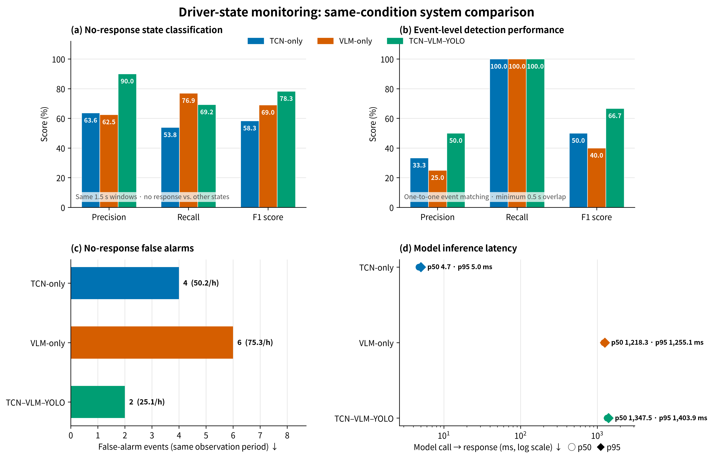
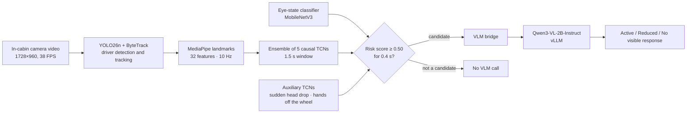

# TCN–VLM Driver Non-Responsiveness Monitoring

English | [한국어](README.ko.md)

A staged driver-monitoring system for in-cabin video. **A TCN first selects risky candidate segments, and only those segments are checked by a VLM (Qwen3-VL).**
Compared with running the VLM on every segment, the goal is to raise the F1 score for detecting no visible response (NVR) while reducing false alarms.

> Sanghyun Jeon, Yeon Lee, Minseok Choi, Jong-Chan Kim, **"TCN–VLM Integrated Framework for Driver Non-Responsiveness Monitoring"**, Korean Society of Automotive Engineers (KSAE) Conference (25AKSAEJ0742) · Kookmin University
> SEA:ME @ Korea, 3rd cohort, VLM/LLM project

<p align="center"></p>

## Key results

An in-cabin driver video of about 287 s was split into 192 segments of 1.5 s. The three systems were compared under the same conditions on **no visible response (NVR) vs. all other states**.

| System | NVR precision | NVR recall | **NVR F1** | Event F1 | False-alarm events | Mean model-call latency |
| --- | ---: | ---: | ---: | ---: | ---: | ---: |
| TCN-only | 0.636 | 0.538 | 0.583 | 0.500 | 4 | 4.9 ms |
| VLM-only | 0.625 | **0.769** | 0.690 | 0.400 | 6 | 1,212.5 ms |
| **TCN–VLM–YOLO (proposed)** | **0.900** | 0.692 | **0.783** | **0.667** | **2** | 1,344.1 ms |

- All three systems detected both real NVR events (event recall 1.000). The proposed system reduced false-alarm events from 6 (VLM-only) to 2.
- The table is recomputed exactly by `./scripts/evaluate.sh` from the paper's run logs included in this repository (no GPU, video or weights needed).
- Latency is measured per model call. The VLM runs asynchronously from the TCN, and duplicate calls are suppressed while an inference is in progress.

## System architecture



1. **Driver tracking** — YOLO26n + ByteTrack track only the person in the driver's seat. When detection drops out, the previous box and the seat region are kept.
2. **Time-series features** — 32 features are extracted at 10 Hz: eye aspect ratio, eye-closure duration, PERCLOS, head pose and angular velocity, head–shoulder relative displacement, upper-body motion and observation reliability.
3. **TCN candidate selection** — An ensemble of 5 causal TCNs looks at the last 1.5 s (15 time steps) and outputs a risk score. A segment becomes a candidate when the score stays at 0.50 or above for 0.4 s. A sudden head drop, sustained eye closure and uncertain eye observation are used as auxiliary conditions.
4. **VLM context check** — For each candidate, a 1.5 s driver-centered clip and the TCN score trend are given to Qwen3-VL together. The VLM judges the eye, head and upper-body state, steering-wheel engagement, voluntary motion and posture recovery, and classifies the driver into one of three states. The criteria are written so that passive motion caused by a passenger pushing or supporting the driver is not counted as voluntary motion.

Detailed parameters, the feature list and output formats are in [docs/pipeline_details.md](docs/pipeline_details.md) (Korean).

## Repository layout

```text
VLM-LLM/
├── scripts/                  # Entry points (use them in the order of "How to run" below)
│   ├── evaluate.sh           #   Compare the three systems on shared segments → reproduce the paper table
│   ├── start_vllm.sh         #   Qwen3-VL-2B-Instruct vLLM server (127.0.0.1:8001)
│   ├── start_bridge.sh       #   VLM bridge (127.0.0.1:8000), fusion | vlm-only
│   ├── run_tcn_vlm_yolo.sh   #   Proposed system
│   ├── run_vlm_only.sh       #   Baseline: classify every 1.5 s segment with the VLM
│   ├── run_tcn_only.sh       #   Baseline: 3-state classification directly from the TCN
│   ├── download_assets.sh    #   Download public weights (YOLO26n, MediaPipe) + SHA256 check
│   └── check_assets.sh       #   Check that the required weights and video are present
├── src/
│   ├── pipeline/             # Runners for the three systems (video → features → TCN/VLM → logs)
│   ├── bridge/               # VLM prompt construction, vLLM calls, 3-state response parsing
│   ├── features/             # Driver selection (YOLO), 32-feature extraction, sudden-drop detection
│   ├── models/               # TCN and eye-state model definitions and training code
│   └── evaluation/           # Shared 1.5 s segment evaluation, event-level evaluation, figures
├── configs/
│   ├── tcn/                  # Input window settings (1.5 s / 10 Hz / 32 features)
│   └── ensembles/            # Ensemble members, thresholds, validation metrics (weight paths relative to assets/)
├── data/labels/              # Ground-truth labels for the evaluation video (1 s resolution)
├── results/paper_20260917/   # Run logs used in the paper (inputs/) and evaluation results (evaluation/)
└── assets/                   # (not in Git) location for weights and videos
```

## How to run

### 0. Installation

Tested with Python 3.11 on a CUDA GPU (NVIDIA DGX Spark GB10, Ubuntu). vLLM runs from the Docker image `nvcr.io/nvidia/vllm:26.07-py3`.

```bash
git clone https://github.com/sangj-03/VLM-LLM.git
cd VLM-LLM
python3 -m venv .venv && source .venv/bin/activate   # a conda environment also works
pip install -r requirements.txt                      # install the CUDA build of torch for your platform first
```

All scripts use `python3`. To use another interpreter, set it explicitly, e.g. `PYTHON=/path/to/python ./scripts/...`.

### 1. Reproduce the paper results (no GPU or video needed)

```bash
./scripts/evaluate.sh
```

This reads the three run logs in `results/paper_20260917/inputs/`, prints the table above, and rewrites the figures and metrics in `results/paper_20260917/evaluation/`.

```text
system            acc      P      R     F1  event F1  event FP  model ms
TCN-only        0.948  0.636  0.538  0.583     0.500         4       4.9
VLM-only        0.953  0.625  0.769  0.690     0.400         6    1212.5
TCN–VLM–YOLO    0.974  0.900  0.692  0.783     0.667         2    1344.1
```

### 2. Prepare assets

```bash
./scripts/download_assets.sh   # download yolo26n.pt and face_landmarker.task
./scripts/check_assets.sh      # list missing files
```

Trained weights and the evaluation video are not included in the repository. Place them as shown below, and the scripts and `configs/ensembles/*.json` will find them without changes.

```text
assets/
├── videos/1000013115_0-287s.mp4            # evaluation video (set VIDEO=... to use another one)
└── weights/
    ├── yolo26n.pt                          # public weights (download_assets.sh)
    ├── face_landmarker.task                # public weights (download_assets.sh)
    ├── eye_state_mrl_v2_pretrained.pt      # eye open/closed classifier (trained on the MRL Eye Dataset)
    └── tcn/
        ├── observable_state_v38/           # main TCN, seeds 72–76                ─┐
        ├── control_engagement_1p5s/        # steering-engagement TCN, seeds 82–86 ├ proposed system
        ├── fall_onset_1s_v32/              # sudden-drop TCN, seeds 42–46         ─┘
        └── multitask_state_v35/            # TCN-only baseline, seeds 42–46
```

### 3. Start the VLM server and the bridge

Run these in separate terminals, in order. The first run downloads the container image and the model weights (about 4 GB).

```bash
# Terminal 1: Qwen3-VL-2B-Instruct (OpenAI-compatible API, 127.0.0.1:8001)
./scripts/start_vllm.sh

# Terminal 2: bridge (127.0.0.1:8000)
./scripts/start_bridge.sh fusion       # for the proposed system: the prompt includes the TCN score trend
# ./scripts/start_bridge.sh vlm-only   # for the VLM-only baseline
```

The default GPU memory fraction in `start_vllm.sh` (0.1) assumes 128 GB of unified memory. On a regular GPU, raise it so that about 8 GB is available, e.g. `GPU_MEMORY_UTILIZATION=0.5`. To use a locally installed vLLM without Docker, add `VLLM_MODE=native`.

### 4. Run the three systems

The video plays at real-time speed, so one run on the 287 s video takes about 5 minutes. If a display is available, an overlay preview window opens; otherwise it is turned off automatically.

```bash
./scripts/run_tcn_vlm_yolo.sh   # proposed system (bridge in fusion mode)
./scripts/run_vlm_only.sh       # VLM-only (bridge in vlm-only mode)
./scripts/run_tcn_only.sh       # TCN-only (no VLM needed)
```

Results are saved in `outputs/<system>/`. Extra arguments are passed through to the runner (see `--help` for all options), and the `VIDEO`, `OUTPUT_ROOT` and `BRIDGE_URL` environment variables change the input and output locations.

### 5. Evaluate new runs

```bash
./scripts/evaluate.sh --latest    # latest 3 runs in outputs/ → outputs/evaluation/
```

When the VLM is called depends on real-time processing speed, so the numbers can change slightly between runs.


## References

- Models used: [Qwen3-VL-2B-Instruct](https://huggingface.co/Qwen/Qwen3-VL-2B-Instruct), [Ultralytics YOLO26](https://docs.ultralytics.com/), [MediaPipe](https://ai.google.dev/edge/mediapipe), [vLLM](https://github.com/vllm-project/vllm). Each model and dataset is subject to its own license.
